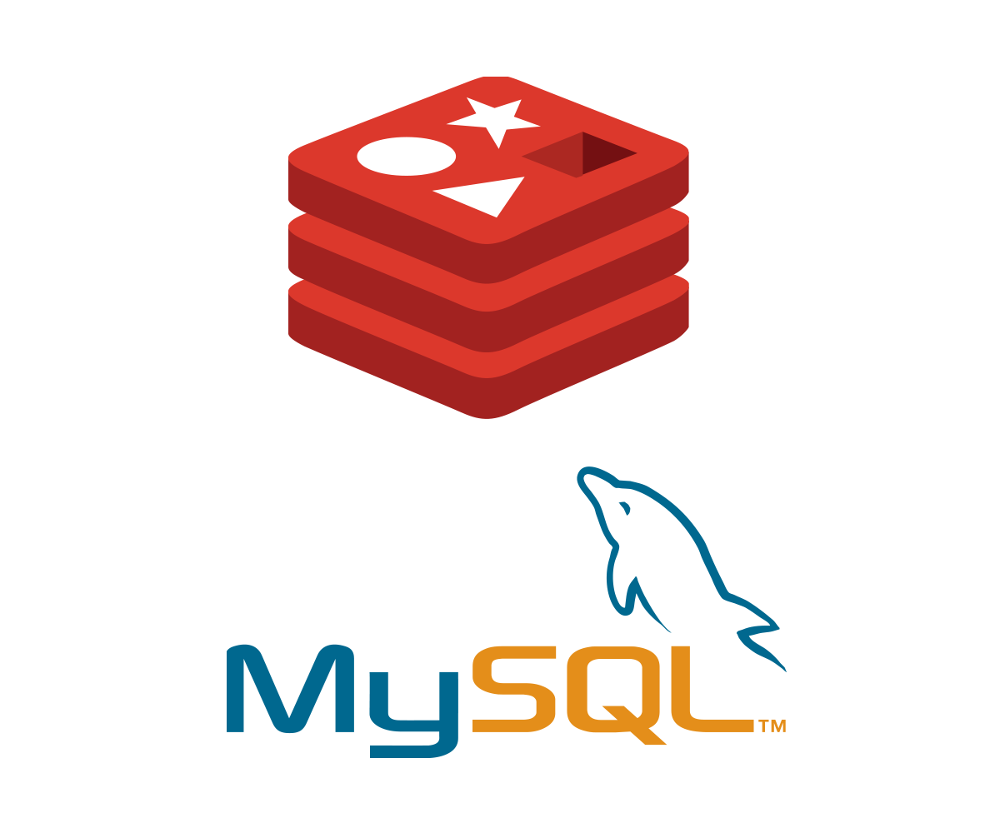
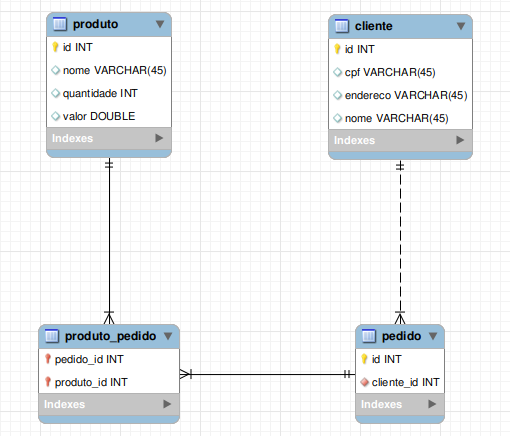

# Projeto API E-Commerce

A solução proposta visa usar o Redis para fazer o cache e agilizar o as consultas feitas para todas as entidades do sistema e o Mysql para fazer persistência dos dados. Como as duas soluções pretendemos garantir que o sistema funcione de forma ágil e desacoplada do Mysql quando for necessário fazer as consultas.

##  Pré-requisitos para execução da API
 - Tecnologias necessárias.
 
    1- Para executar o projeto é necessário ter instalado Java SE Development Kit.
    
    2- Utilizar uma IDE para execução.
    
    3- [Instalar Msql](https://www.mysql.com/downloads/)
    
    4- [Instalar Redis](https://redis.io/topics/quickstart)
    
    5- [Instalar Postman](https://www.postman.com/downloads/)
---

## Modelo do banco de dados (EER)

## Instalação e execução do projeto

- Baixar o projeto: `$ git clone https://github.com/teixeira308/ApiEcommerce.git`

- No diretório `src` no pacote `br.ecommerce.api.test` existe um arquivo chamado `SpringTest.java`. 
Abra esse arquivo e execute `Run`

- Executar redis-server.

- Importar para o Postman a collection ecommerce.postman_collection.json localizada na raiz do projeto

- Executar a requisição POST no Postman para criação de produtos, clientes e pedidos

- Executar a requisição GET no Postman para consultar os cadastros

---
